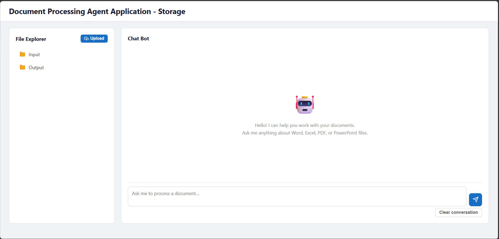
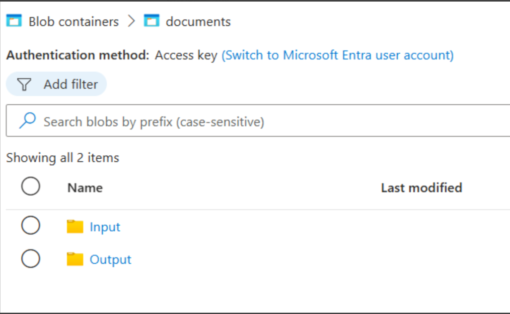

# Document Processing AI Agent Application - Web

## Description

A web-based application for scalable AI-powered document processing built with ASP.NET Core and powered by OpenAI and Syncfusion Agent tools. It integrates with the [Microsoft Agent Framework](https://learn.microsoft.com/en-us/agent-framework/overview/?pivots=programming-language-csharp) to enable autonomous document operations with persistent conversation history in distributed environments.

The application supports flexible storage backends including Azure Blob Storage, AWS S3, and local disk by implementing the IDocumentStorage interface. Documents are read from and written to storage on each tool invocation with no in-memory objects maintained between calls—each operation opens the document from storage, processes it, and saves it back, making it ideal for distributed systems, serverless architectures, and scenarios requiring document persistence.

## Prerequisites

### Requirements
- .NET 8.0 or later
- [Azure Blob storage](https://azure.microsoft.com/en-in/pricing/purchase-options/azure-account/search/)
- [Redis server](https://azure.microsoft.com/en-us/products/cache) (optional, for production deployment - defaults to in-memory cache)
- [OpenAI API key](https://platform.openai.com/api-keys)
- [Syncfusion license key](https://www.syncfusion.com/products/communitylicense)

## How to Run
### 1. Configure API Keys and License
Choose one of the following methods to set up your API credentials and license key:

**Option 1: Set Environment Variables**
```bash
# OpenAI API Configuration
setx OPENAI_API_KEY "your-openai-api-key"
setx OPENAI_MODEL "gpt-4o"  # Optional, defaults to gpt-4o

# Redis Configuration (for production/distributed deployment)
setx REDIS_CONNECTION_STRING "localhost:6379"  # Optional, defaults to in-memory cache

# Syncfusion License
setx SYNCFUSION_LICENSE_KEY "your-syncfusion-license-key"

# Azure Blob Storage (Optional)
setx AZURE_BLOB_CONNECTION_STRING "your-storage-connection-string"
setx AZURE_BLOB_CONTAINER_NAME "your-container-name"
```

**Option 2: Set API key in Code**
Go to [AgentService.cs](./AgentChatWeb/Services/AgentService.cs) and replace with your API key:
``` csharp
string? apiKey = "your-openai-api-key";
string? modelId = "gpt-4o";
string? sfKey = "your-syncfusion-license-key";
string? connectionString = "your-storage-connection-string";
string? containerName = "your-contaniner-name";
```
### 2. Setup
```bash
# Navigate to the project directory
cd Examples/ASP.NET-Core/AgentChatWeb

# Restore NuGet packages
dotnet restore

# Build the project
dotnet build
```

### 3. Run the Application
```bash
# Development
dotnet run

# With custom port
dotnet run --urls "https://localhost:5001"
```
Simply type your [document processing request at the prompt](https://help.syncfusion.com/document-processing/ai-agent-tools/example-prompts) and press Enter to execute it!

The application will be available at `https://localhost:5001`

Once the application starts, you'll see output similar to:


### Usage

The application supports flexible storage backends including Azure Blob Storage, AWS S3, and local disk. Documents are stored and retrieved on each operation with no in-memory objects maintained between calls—each operation opens the document from storage, processes it, and saves it back.

- **Input**: Place your input documents here before running the application
  - Supported formats: .docx, .xlsx, .pdf, .pptx, .json, .csv, .md, .txt and more
  - Example files: `new_hire_data.json`, `release_notes_v3.2.md`

- **Output**: Generated and processed documents are automatically saved here
  - Contains results from document creation, conversion, and processing operations
  - Organized by operation type for easy access

Please ensure that the folder structure within the blob storage containers is as follows:



## License
Syncfusion .NET Document SDK library requires a commercial license for production use. A [free community license](https://www.syncfusion.com/products/communitylicense) is available for qualifying organizations.

## Related Resources

- [Syncfusion Agent tools](https://help.syncfusion.com/document-processing/ai-agent-tools/overview)
- [Agent Framework](https://github.com/microsoft/agents)

