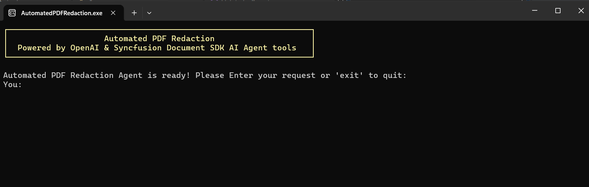

# Automated PDF Redaction Agent - Console

## Description

A command-line application that demonstrates intelligent automated PDF redaction using AI. Built with .NET and powered by OpenAI and Syncfusion PDF Agent tools, it integrates with the [Microsoft Agent Framework](https://learn.microsoft.com/en-us/agent-framework/overview/?pivots=programming-language-csharp) to autonomously detect and redact sensitive information from PDF documents.

The application uses an **in-memory document model** where PDF documents are maintained as live objects within the document manager and automatically cleaned up after 10 minutes (default) of inactivity. This expiration time is customizable.

## Prerequisites

### Requirements
- .NET 8.0 or later
- [OpenAI API key](https://platform.openai.com/api-keys)
- [Syncfusion license key](https://www.syncfusion.com/products/communitylicense)

## How to Run
### 1. Configure API Keys and License
Choose one of the following methods to set up your API credentials and license key:

**Option 1: Set Environment Variables**
```bash
# OpenAI Configuration
setx OPENAI_API_KEY "your-openai-api-key"
setx OPENAI_MODEL "gpt-4o"  # Optional, defaults to gpt-4o

# Syncfusion License
setx SYNCFUSION_LICENSE_KEY "your-syncfusion-license-key"
```

**Option 2: Set API key in Code**
Go to [Program.cs](./Program.cs) and replace with your API key:
``` csharp
string? apiKey = "your-openai-api-key";
string? deploymentName = "gpt-4o";
string? syncfusionKey = "your-syncfusion-license-key";
```

### 2. Setup
```bash
# Navigate to the project directory
cd Examples/Console/AutomatedPDFRedaction

# Restore NuGet packages
dotnet restore

# Build the project
dotnet build
```

### 3. Run the Application
```bash
dotnet run
```

Once the application starts, you'll see output similar to:



### Usage

The application uses two folders for file management:

- **[Data/Input](./Data/Input/)**: Place your PDF documents here before running the application
  - Supported format: .pdf
  - Example file: `case_filing.pdf`

- **[Data/Output](./Data/Output/)**: Redacted PDF documents are automatically saved here
  - Named with `_redacted.pdf` suffix (e.g., `case_filing_redacted.pdf`)
  - Original PDFs remain unchanged

## Automated Redaction Workflow

The agent follows a comprehensive, sequential workflow to ensure all sensitive data is properly identified and redacted:

### 1. Document Loading
- Loads the specified PDF document into memory
- Creates a tracking reference for the document to use throughout the process

### 2. Text Extraction
- Extracts all text content from the PDF
- Analyzes the text layout and position information for accurate redaction

### 3. Sensitive Data Detection
The AI agent intelligently identifies and categorizes:
- **Personal Information**: Names, emails, phone numbers, addresses
- **Financial Data**: Social Security numbers, credit card numbers, and other sensitive identifiers

### 4. Text Location & Redaction
- Locates all identified sensitive items within the document
- Applies permanent black box redaction to completely obscure the content

### 5. Document Export
- Saves the redacted PDF with all changes applied
- Outputs to the configured Output directory with the original PDF remaining unchanged

## Example Prompts

**Example 1: Automatic Sensitive Information Redaction**
```
Load 'Fictional_Test_Personal_Financial_Data.pdf' from {InputDir} and redact all the sensitive 
information including name, card information, etc. and save the output as 
'Fictional_Test_Personal_Financial_Data_Redacted.pdf' to {OutputDir}
```

**Example 2: Targeted Text Redaction with Specific Identifiers**
```
Load the court filing document 'case_filing.pdf' from {InputDir} and find the text 'John Michael' 
and 'Ellwood Drive, Austin, TX 78701' and '472-90-1835'. Permanently redact all identifiable 
information. Use black highlight color for all redactions. Export the redacted document as 
'case_filing_redacted.pdf' to {OutputDir}.
```

## License
Syncfusion .NET Document SDK library requires a commercial license for production use. A [free community license](https://www.syncfusion.com/products/communitylicense) is available for qualifying organizations.

## Related Resources

- [Syncfusion Agent tools](https://help.syncfusion.com/document-processing/ai-agent-tools/overview)
- [Agent Framework](https://github.com/microsoft/agents)

