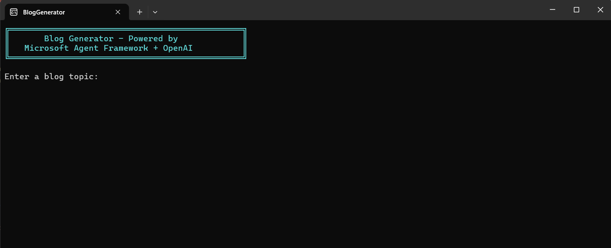

# Document Processing AI Agent Application - Blog Generator

## Description

A command-line application that automatically generates rich, styled blog posts with AI-generated content and images. Built with .NET and powered by OpenAI and Syncfusion Agent tools, it integrates with the [Microsoft Agent Framework](https://learn.microsoft.com/en-us/agent-framework/overview/?pivots=programming-language-csharp) to autonomously create complete blog posts through an interactive multi-phase workflow.

The application generates blogs in both **HTML** and **Word document** formats, complete with:
- AI-generated titles and structured outlines
- Professionally styled section content
- AI-generated images with captions
- Responsive CSS layouts
- Automatic HTML-to-Word conversion using [Syncfusion Document SDK AI Agent Tool](https://www.nuget.org/packages/Syncfusion.DocumentSDK.AI.AgentTools)

## Prerequisites

### Requirements
- .NET 8.0 or later
- [OpenAI API key](https://platform.openai.com/api-keys)
- [Syncfusion license key](https://www.syncfusion.com/products/communitylicense) 

## How to Run

### 1. Configure API Keys and License
Choose one of the following methods to set up your API credentials:

**Option 1: Set Environment Variables**
```bash
# OpenAI Configuration
setx OPENAI_API_KEY "your-openai-api-key"
setx OPENAI_TEXT_MODEL "gpt-4o"  # Optional, defaults to gpt-4o
setx OPENAI_IMAGE_MODEL "gpt-image-1.5"  # Optional, defaults to gpt-image-1.5

# Syncfusion License (Optional)
setx SYNCFUSION_LICENSE_KEY "your-syncfusion-license-key"
```

**Option 2: Set API key in Code**
Go to [Program.cs](./Program.cs) and replace with your API key:
```csharp
var apiKey = "your-openai-api-key";
var textModel = "gpt-4o";
var imageModel = "gpt-image-1.5";
```

### 2. Setup
```bash
# Navigate to the project directory
cd Examples/Console/BlogGenerator

# Restore NuGet packages
dotnet restore

# Build the project
dotnet build
```

### 3. Run the Application
```bash
dotnet run
```

Once the application starts, you'll see the banner and be prompted to enter a blog topic.

### Usage

#### Workflow

The application follows a 5-phase automated workflow:

1. **Phase 1 - Title & Outline Generation**
   - Enter your blog topic
   - Review AI-generated title and outline
   - Approve, reject, or regenerate

2. **Phase 2 - Section Planning**
   - AI plans section types (intro, body, conclusion)
   - Determines which sections need images

3. **Phase 3 - Content Generation**
   - Generates HTML content for each section
   - Applies professional styling and formatting

4. **Phase 4 - Image Generation**
   - Creates AI image prompts
   - Generates images using GPT Image 1.5
   - Embeds images with captions

5. **Phase 5 - Document Assembly**
   - Assembles complete HTML blog
   - Converts HTML to Word document format using [Syncfusion Document SDK AI Agent Tool](https://www.nuget.org/packages/Syncfusion.DocumentSDK.AI.AgentTools)
   - Saves both files to output folder

#### Output

Generated files are automatically saved to:

- **[Data/Output](./Data/Output/)**: Contains generated blog documents
  - `{blog-title}.html` - Styled HTML blog with embedded images
  - `{blog-title}.docx` - Word document version

## License

Syncfusion .NET Document SDK library requires a commercial license for production use. A [free community license](https://www.syncfusion.com/products/communitylicense) is available for qualifying organizations.

## Related Resources

- [Syncfusion Agent tools](https://help.syncfusion.com/document-processing/ai-agent-tools/overview)
- [Agent Framework](https://github.com/microsoft/agents)