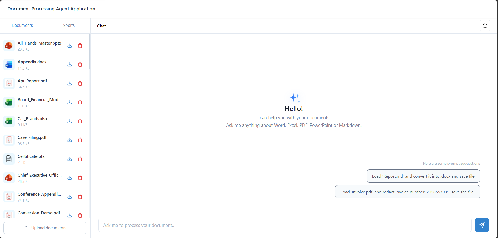

# Document Processing AI Agent Application - Web

## Description

A web-based application for scalable AI-powered document processing built with ASP.NET Core and powered by OpenAI and Syncfusion Agent tools. It integrates with the [Microsoft Agent Framework](https://learn.microsoft.com/en-us/agent-framework/overview/?pivots=programming-language-csharp) to enable autonomous document operations with persistent conversation history in distributed environments.

The application uses a local file-system storage backend implemented via the `IDocumentStorage` interface (see [LocalBlobStorage.cs](./Storage/LocalBlobStorage.cs)). Documents are read from and written to the local `Data\Input` and `Data\Output` folders on each tool invocation, with no in-memory objects maintained between calls — each operation opens the document from storage, processes it, and saves it back. This keeps the agent stateless and makes the app ideal for single-server deployments, containerized environments, and local development scenarios.

## Prerequisites

### Requirements
- .NET 8.0 or later
- [OpenAI API key](https://platform.openai.com/api-keys)
- [Syncfusion license key](https://www.syncfusion.com/products/communitylicense)

## How to Run
### 1. Configure API Keys and License
Choose one of the following methods to set up your API credentials and license key:

**Option 1: Set Environment Variables**
```bash
# OpenAI API Configuration
setx OPENAI_API_KEY_AGENT "your-openai-api-key"
setx OPENAI_Model_AGENT "gpt-4o"  # Optional, defaults to gpt-4o

# Syncfusion License
setx Sf_LICENSEKEY_AGENT "your-syncfusion-license-key"
```

**Option 2: Set API key in Code**
Go to [AgentService.cs](./Services/AgentService.cs) and replace with your API key:
``` csharp
string? apiKey = "your-openai-api-key";
string? modelId = "gpt-4o";
string? sfKey = "your-syncfusion-license-key";
```
### 2. Setup
```bash
# Navigate to the project directory
cd Examples/Showcase/DocumentSDKAIAgentTool

# Restore NuGet packages
dotnet restore

# Build the project
dotnet build
```

### 3. Run the Application
```bash
# Development
dotnet run

# With custom port
dotnet run --urls "https://localhost:5001"
```
Simply type your [document processing request at the prompt](https://help.syncfusion.com/document-processing/ai-agent-tools/example-prompts) in the browser chat UI and press Enter to execute it!

The application will be available at `https://localhost:5001`

Once the application starts, you'll see output similar to:


### Usage

The application uses a local file-system storage backend (see [LocalBlobStorage.cs](./Storage/LocalBlobStorage.cs)). Documents are stored and retrieved on each operation with no in-memory objects maintained between calls — each operation opens the document from storage, processes it, and saves it back.

- **Input**: Place your input documents in the `Data\Input` folder before running the application
  - Supported formats: .docx, .xlsx, .pdf, .pptx, .json, .csv, .md, .txt and more
  - Example files: `new_hire_data.json`, `release_notes_v3.2.md`

- **Output**: Generated and processed documents are automatically saved in the `Data\Output` folder
  - Contains results from document creation, conversion, and processing operations


## License
Syncfusion .NET Document SDK library requires a commercial license for production use. A [free community license](https://www.syncfusion.com/products/communitylicense) is available for qualifying organizations.

## Related Resources

- [Syncfusion Agent tools](https://help.syncfusion.com/document-processing/ai-agent-tools/overview)
- [Agent Framework](https://github.com/microsoft/agents)
